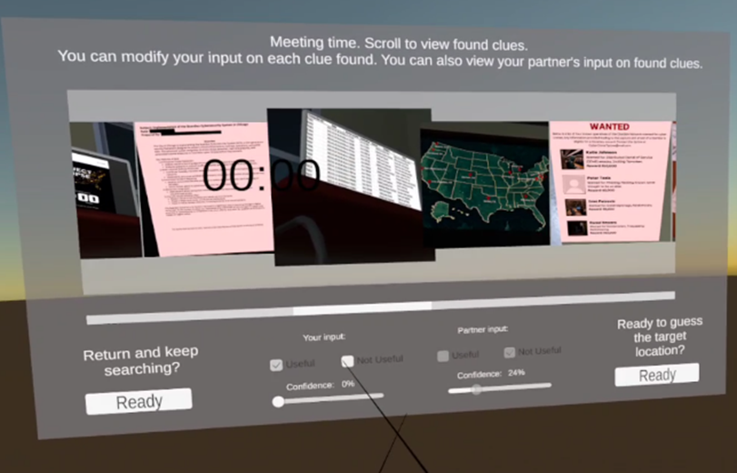
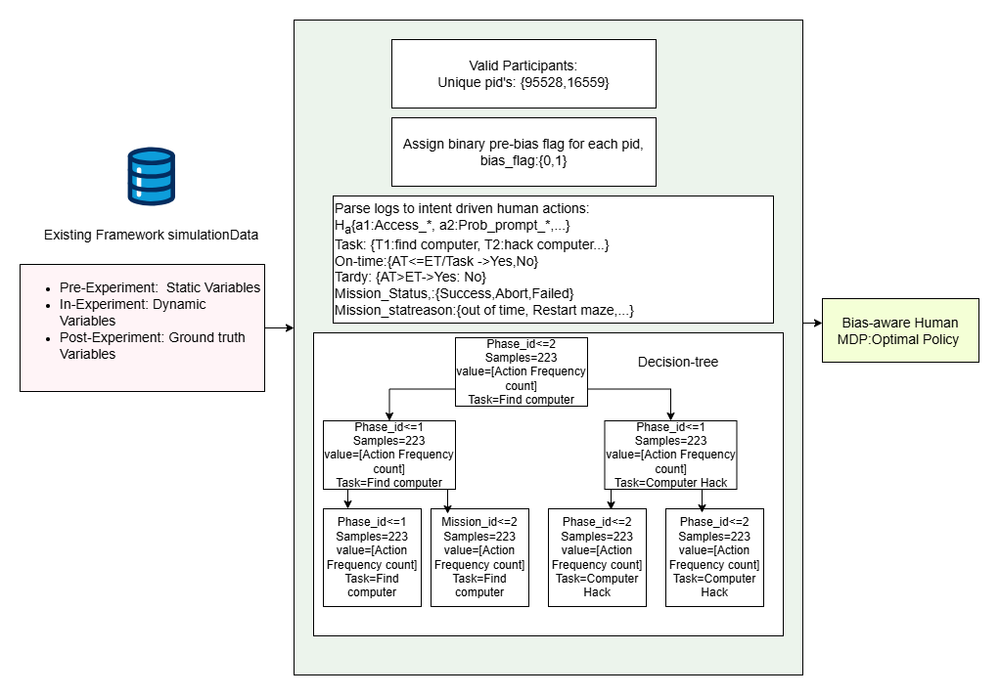
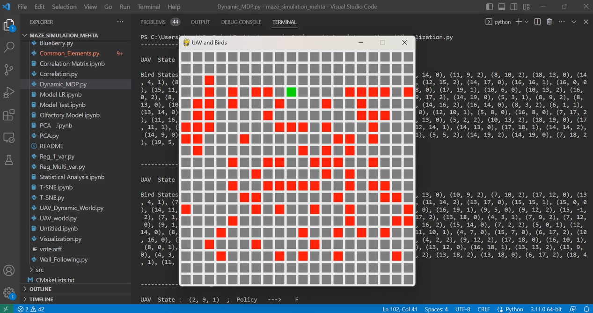

<!--
Credits and references used in this README:

1) Layout ideas and section inspiration:
   https://github.com/abhisheknaiidu/awesome-github-profile-readme?tab=readme-ov-file#descriptive-

2) Skill icons (SVG badges):
   https://github.com/tandpfun/skill-icons?tab=readme-ov-file#icons-list

3) GitHub stats card:
   https://github.com/anuraghazra/github-readme-stats
-->

# 🤖 Anusha Challa
**`Data Scientist | AI Researcher (HRI + Trust Modeling) | MS AI(Thesis) Graduate @ University of Georgia 25`**

## About Me
- I am a Data Scientist and AI Researcher focused on **trust-aware AI** for **human–robot collaboration**.
- At UGA (THINC Lab), I build **VR-based HRI testbeds** and develop **probabilistic models** to understand and predict human behavior.
- I enjoy turning research into clean, reusable code with clear experiments, evaluation, and results.
---

## Skill stack
<!-- Skill icons provided by skillicons.dev -->

**Also comfortable with**: Hugging Face, Pandas/NumPy, Tableau/Power BI, reinforcement learning, Bayesian/probabilistic modeling, experiment design, evaluation & reporting.

---

<h2>Projects - showcase</h2>

<table>
  <tr>
    <td align="center" width="33%">
      
       
      <b>VR Human–AI Trust Testbed</b> 
      Unity + Python VR environment to study trust, transparency, and decision-making in HRI. 
      🔗 <a href="https://github.com/challaanusha46/VR_HRI_I-P">Repo</a> 
      Tags: Unity, HRI, Trust Modeling
    </td>
    <td align="center" width="33%">
      
       
      <b>Bias-Aware Human MDP</b> 
      Behavior-log parsing and decision modeling for bias-aware policy reasoning in HRI tasks. 
      🔗 <a href="https://github.com/challaanusha46/Bias-Human-MDP">Repo</a> 
      Tags: MDP, Bayesian Modeling, Research
    </td>
    <td align="center" width="33%">
      
       
      <b>Reinforcement Learning Experiments</b> 
      RL implementations with simulation demos, training runs, and evaluation outputs. 
      🔗 <a href="https://github.com/challaanusha46/RL-assign">Repo</a> 
      Tags: RL, Python, Simulation
    </td>
  </tr>
</table>

---
## Publications
- [**A Novel Computational Framework of Robot Trust for Human-Robot Teams** (ICRA 2025)](http://thinc.cs.uga.edu/files/nfdcjICRA25.pdf)

- [**A Computational Model of Robot Trust for Human-Robot Teams** (ARMS @ AAMAS 2024)](http://thinc.cs.uga.edu/files/nfcdcARMS2024.pdf)

- [**A new MCDM approach integrating QFD, DEMATEL with TOPSIS for exploring the effect of social network usage on academic performance**](https://www.researchgate.net/publication/305250877_A_new_MCDM_approach_integrating_QFD_dematel_with_topsis_for_exploring_the_effect_of_social_network_usage_on_academic_performance)
  
- **Google Scholar**  
  - https://scholar.google.com/citations?pli=1&authuser=2&user=Y9kL_HUAAAAJ
---

## Links
- [**LinkedIn**](https://www.linkedin.com/in/challaanusha/)
- [**GitHub**](https://github.com/challaanusha46)
- [**Contact**](mailto:anusha.challaac@gmail.com)

